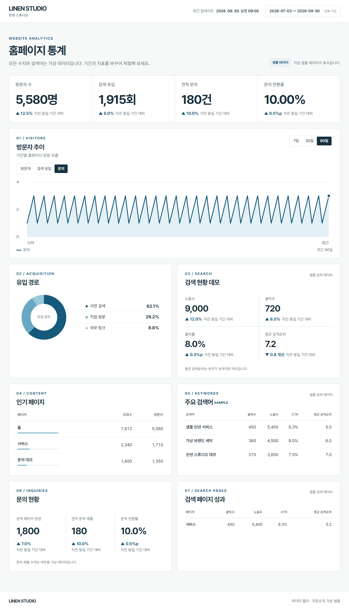

# Linen Studio — 기업 웹사이트 포트폴리오

[기술 구성](docs/PROJECT.md) · [배포 안내](docs/DEPLOYMENT.md) · [유지보수](docs/MAINTENANCE.md) · [전체 docs](docs/)

기업 고객이 **서비스를 이해하고 문의까지 이어갈 수 있는 웹사이트**와, 방문·검색·문의 지표를 한눈에 확인하는 통계 화면을 구현한 프로젝트입니다.

실제 기업 웹사이트 개발 경험을 바탕으로 가상 브랜드 **Linen Studio**와 예시 콘텐츠로 재구성했습니다. 개발의 초점은 **반응형 화면, 문의폼의 입력 경험, 통계 시각화, 공통 UI의 유지보수**에 두었습니다.

## 개발 범위

| 영역 | 구현 내용 |
| --- | --- |
| 기업 웹사이트 | 브랜드 소개, 서비스, 사용자 흐름, 공간 소개, 문의 화면을 다중 페이지로 구성 |
| 반응형 UI | 화면 폭에 따른 레이아웃·메뉴 전환, 모바일에서도 읽기 쉬운 정보 배치 |
| 문의폼 | 필수값·연락처·이메일 검증, 필드별 오류 안내, 첨부파일 선택·삭제·드래그 앤 드롭 |
| 통계 대시보드 | 기간·지표 전환, 방문 추이, 유입 경로, 인기 페이지, 검색 성과, 문의 전환율 표시 |
| 공통 UI | 푸터를 HTML partial로 분리하고 공통 스크립트·스타일을 여러 페이지에서 재사용 |
| 접근성·검사 | 키보드 조작, 상태 안내, 모션 감소 설정, 링크·자료·샘플 데이터 검사 |

## 중점적으로 구현한 부분

### 1. 서비스 탐색에서 문의로 이어지는 화면 구성

브랜드와 서비스 소개를 페이지별로 나누고, 주요 화면에서 문의 데모로 이동할 수 있도록 구성했습니다. 공통 탐색 메뉴와 푸터로 페이지 간 이동 방식을 일관되게 유지했습니다.

데스크톱의 이미지·설명 2단 배치는 모바일에서 1단으로 전환합니다. 모바일 메뉴에는 열림 상태를 나타내는 `aria-expanded`, Escape로 닫기, 메뉴 버튼으로의 포커스 복귀를 적용했습니다.

### 2. 입력 오류를 바로 이해할 수 있는 문의폼

필수 항목, 국내 휴대전화·지역번호 형식, 이메일과 입력 범위를 검증합니다. 필드를 벗어나면 오류를 안내하고, 잘못된 값을 수정하는 동안 안내를 갱신합니다. 제출 시에는 첫 번째 오류 항목으로 포커스를 이동합니다.

첨부파일은 선택과 드래그 앤 드롭을 지원합니다. 최대 3개, 파일당 10MB, 전체 20MB 제한과 허용 확장자를 검사하며, 같은 파일의 중복 추가를 막습니다. 선택 목록에는 파일명·크기·삭제 버튼과 전체 용량을 표시합니다.

공개 데모에서는 입력 검증 후 완료 메시지만 표시합니다. **입력 내용과 첨부파일은 전송하거나 저장하지 않습니다.**

### 3. 기간과 지표를 바꾸며 볼 수 있는 통계 화면

7·30·90일 조회와 방문자·검색 유입·문의 지표 전환을 구현했습니다. 요약 지표, SVG 추이 차트, 유입 경로 도넛 차트, 검색 성과 표를 함께 표시합니다. 별도 차트 라이브러리 없이 SVG와 CSS로 구성했습니다.

기간을 빠르게 전환할 때는 이전 요청을 취소하고, 이전 응답이 새 화면을 덮어쓰지 않도록 요청 상태를 확인합니다. 로딩·빈 데이터·일부 데이터 오류·전체 로드 실패를 구분해 안내합니다. 모바일에서는 검색 성과 표를 항목별로 읽기 쉬운 형태로 전환합니다.

현재 저장소에서는 **기간별 가상 JSON 데이터**를 사용합니다. 실제 기업의 통계와 검색어는 포함하지 않습니다.

### 4. 접근성과 유지보수를 고려한 공통 동작

본문 바로가기, 입력 필드의 label, 오류를 연결하는 `aria-describedby`, 입력 오류 상태인 `aria-invalid`, 상태 변화를 알리는 `aria-live`를 적용했습니다. 파일 선택 영역도 키보드로 조작할 수 있고, 파일명은 `textContent`로 표시합니다.

푸터는 공통 HTML partial로 불러오며, 로드 실패 시 대체 링크를 제공합니다. 공통 스타일과 동작은 각각 `styles.css`와 `app.js`에서 관리합니다. 모션 감소 설정을 존중하는 스타일도 포함했습니다.

## 기술 구성

**HTML · CSS · Vanilla JavaScript**로 구성한 정적 다중 페이지 사이트입니다. 프레임워크나 별도 빌드 단계 없이 HTTP 서버에서 실행할 수 있습니다.

| 파일·디렉터리 | 역할 |
| --- | --- |
| `index.html`, 각 페이지의 `index.html` | 페이지별 콘텐츠와 의미 있는 HTML 구조 |
| `styles.css` | 공통 UI, 반응형 레이아웃, 입력·상태 스타일 |
| `app.js` | 모바일 메뉴, 공통 partial 로딩, 문의 검증, 파일 선택 |
| `partials/` | 공통 푸터 |
| `dashboard/app.js` | 기간·지표 선택, 차트·표 렌더링, 로드 상태 처리 |
| `dashboard/sample-*.json` | 기간별 가상 통계 |
| `assets/` | 데모 전용 벡터 일러스트와 아이콘 |
| `check_demo.py` | 내부 링크·자료, 실제 연동 제외 여부, 샘플 데이터 일관성 검사 |

## 상세 문서와 원본 개발 경험

- [기술 구성과 개발 내용](docs/PROJECT.md): 원본 처리 흐름, 서버 검증·첨부 처리, 통계 인증·응답·계산, 공개 데모와의 차이
- [유지보수 안내](docs/MAINTENANCE.md): 원본과 데모의 수정 위치·검사, 폼·통계 변경 절차, 문제 해결
- [데모 실행과 배포 안내](docs/DEPLOYMENT.md): 원본 외부 서비스·환경변수 설정 설명, 정적 데모 실행·배포·확인 절차

원본 코드에서는 서버 입력·첨부 검증과 봇 확인을 거쳐 문의 이메일을 전송하고, 분석·검색 API 데이터를 대시보드용으로 변환하는 기능도 구현했습니다. 상세 문서에 해당 개발 경험을 설명하지만 **현재 공개 데모에는 서버 코드와 실제 서비스 연결이 없습니다.** 문서는 운영 계정 설정이나 실서비스 검증 완료를 의미하지 않습니다.

## 검증한 내용

- 모든 페이지와 공통 푸터 로딩, 내부 링크·이미지·폰트 경로
- 필수값·전화번호 오류, 파일 형식 제한, 파일 선택과 완료 후 초기화
- 데모 확인 체크박스 검증과 실제 제출·외부 요청이 없는 동작
- 통계 화면의 7·30·90일 전환, 요약 지표와 차트, 문의 지표 선택
- 모바일 메뉴 열기·Escape 닫기와 390px 홈 화면의 가로 넘침 여부
- JavaScript 문법과 샘플 통계의 문의 수·전환율 일관성

브라우저 검사는 Chromium 기반 Edge에서 수행했습니다. 성능 점수나 실서비스 전환율 개선 수치를 측정한 프로젝트로 소개하지 않습니다.

## 화면 미리보기



[모바일 홈 화면 보기](previews/mobile.png)

## 로컬 실행

저장소 루트에서 실행합니다.

```sh
python -m http.server 4173 --bind 127.0.0.1
```

- 웹사이트: <http://127.0.0.1:4173/>
- 문의 데모: <http://127.0.0.1:4173/contact/>
- 통계 데모: <http://127.0.0.1:4173/dashboard/>

공통 HTML을 fetch하므로 `file://` 대신 HTTP 서버를 사용합니다.

```sh
python check_demo.py
node --check app.js
node --check dashboard/app.js
```

정적 호스팅은 저장소 루트를 제공해야 합니다. `/` 기준 링크를 사용하므로 서브경로에 배포하는 GitHub Pages 프로젝트 URL은 지원하지 않습니다.

## 공개 데모 범위와 자료

운영 프로젝트의 커밋 기록, 회사명·연락처·사진·계약 조건·설비 정보, 원본 내부 운영 문서와 실제 서비스 연동 코드는 포함하지 않습니다. `docs/`는 회사 식별정보와 운영 설정을 제외하고 현재 데모에 맞게 재작성한 기술 문서입니다. 문의 전송과 운영 통계 연결은 이 공개 데모의 실행 범위에서 제외했습니다.

브랜드·수치·문구는 데모용 예시이고, 벡터 이미지는 이 데모를 위해 제작했습니다. Pretendard의 원본 저작권 고지와 SIL Open Font License는 `fonts/LICENSE`에 포함했습니다. 저장소 공개는 코드와 디자인에 대한 별도 재사용 라이선스 부여를 뜻하지 않습니다.
